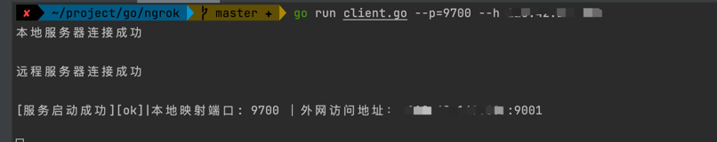
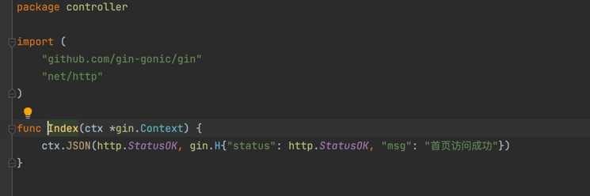
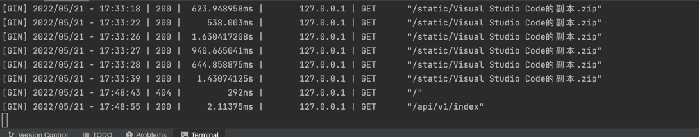
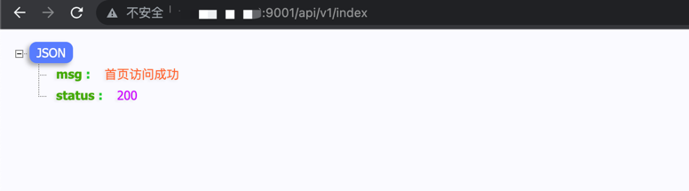

# 简易版内网穿透 -- SNgrok 🚀
1. 代码克隆
2. 执行命令
    ```shel
        go mod download
        go run server.go --p [穿透后对外访问端口] //服务端启动
        go run client.go --p [内网映射端口] --h 远程服务端口 //客户端启动
    ```
 
🧵HTTP穿透效果展示
#### 服务端：

#### 客户端：

#### 本地gin-web服务：


#### 浏览器访问：


💡 HTTP、HTTPS、TCP  
 
🍬协议基于TCP协议，基于TCP协议上的应用协议应该都支持

## 🧩 视频教程
[👉点我进入传送门](https://www.bilibili.com/video/BV1rF411G71G/?vd_source=75806ea6632fb997081f90cfc8e669b6)

✅ 刚接触go项目，写的有点菜不喜勿碰🤝🤝🤝🤝